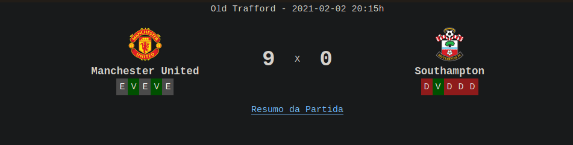

# Welcome to the Premier League!

Just a web crawler that sends you an e-mail with all the results of the Premier League matches in a given period.

How to use it:

```bash
$ python3 -m venv venv
$ source venv/bin/activate
$ pip install -r requirements.txt
$ python premier_league.py --email my@email.com --initial-date 2021-01-01 --final-date 2021-01-31 --host <myhost>
```

## The email template



```bash
$ python premier_league.py -h # For help
```

* `--email`: E-mail that results will be sent.
* `--host`: Your email host. Must be *gmail* or *outlook*.
* `--initial-date`: The initial date that you want the results.
* `--final-date` (optional): The final date that you want the results. By default the final date will be the current date. The period cannot be longer than 31 days.

Enjoy :D

If you are having any trouble please, feel free to send me a message.

Note: Gmail users needs enable [allow less secure apps to access your account.](https://support.google.com/accounts/answer/6010255)
